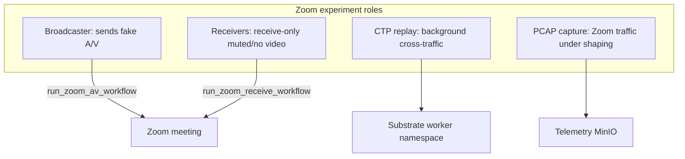
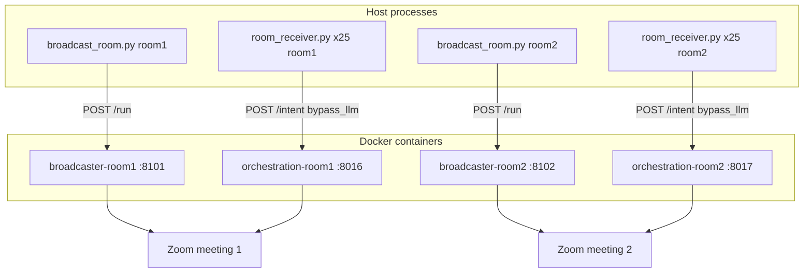
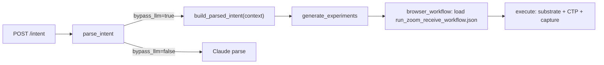

# Zoom Data Collection Runbook

Operational guide for running Zoom bottleneck experiments in this repo: codebase architecture, Zoom room setup, CTP master lists, broadcaster/receiver launch commands, and how natural-language intent parsing is bypassed.

For generic platform quick-start see [README.md](README.md). For legacy LLM-based serial sweeps see [services/orchestration/scripts/SWEEPS_INFO.md](services/orchestration/scripts/SWEEPS_INFO.md).

---

## Table of contents

1. [Codebase overview](#1-codebase-overview)
2. [Required configuration](#2-required-configuration-env--ctp-storage)
3. [Zoom room configuration](#3-zoom-room-configuration)
4. [Master CTP lists](#4-master-ctp-lists)
5. [Prerequisites — start Docker services](#5-prerequisites--start-docker-services)
6. [Starting the 2 broadcast agents](#6-starting-the-2-broadcast-agents)
7. [Starting receivers from bash scripts](#7-starting-receivers-from-bash-scripts)
8. [How NL intent is skipped](#8-how-nl-intent-is-skipped)
9. [End-to-end checklist](#9-end-to-end-checklist)
10. [Performance tuning](#10-performance-tuning)
11. [Monitoring during a run](#11-monitoring-during-a-run)
12. [Troubleshooting](#12-troubleshooting)
13. [Related scripts reference](#13-related-scripts-reference)

---

## 1. Codebase overview

The **Agentic Thin Waist** platform turns research intents into shaped, instrumented network experiments. For Zoom data collection, one broadcaster and many receivers join the same Zoom meeting while cross-traffic (CTPs) is replayed and Zoom traffic is captured under a configured bottleneck.

### Control plane vs data plane

| Service | Port (default) | Role |
|---------|----------------|------|
| **Experiment API** | 8000 | Intent plane — experiment specs |
| **CTP Service** | 8001 | Cross-traffic profile representation |
| **Substrate Worker** | 8002 | tc/netem shaping, tshark capture, tcpreplay CTP injection |
| **NetGent Service** | 8003 | Browser/shell workflow NFA engine |
| **Telemetry** | 8004 | PostgreSQL + MinIO for results and PCAP artifacts |
| **Orchestration** | 8005 | LangGraph agent: NL intent → experiments → execution |

Zoom runs also use **per-room orchestrators** (8016–8025) and **per-room broadcaster workers** (8101–8110) defined in `docker-compose.yml`.

### Key directories

| Path | Role |
|------|------|
| [`run_files/`](run_files/) | Host-side launch scripts, `room_receiver.py`, room env files, logs/pids |
| [`services/orchestration/scripts/`](services/orchestration/scripts/) | `broadcast_room.py`, master CTP lists, `rooms.env`, sweep scripts |
| [`services/orchestration/app/config/workflows/`](services/orchestration/app/config/workflows/) | Zoom workflow JSON |
| [`services/substrate-worker/`](services/substrate-worker/) | Network execution + browserless fake A/V |
| [`docker-compose.yml`](docker-compose.yml) | All service definitions and compose profiles |
| [`.env`](.env) | Host-level CTP paths, API keys, orchestrator settings |

### Zoom experiment roles



- **Broadcaster** — one per Zoom room; joins with mic unmuted and video on; streams looping WAV/MJPEG. Does **not** go through the orchestrator (direct `POST /run` to `broadcaster-roomN`).
- **Receivers** — many per room; join receive-only (muted, no camera); each runs one CTP at a time under shaped network; PCAP saved to telemetry.
- **Orchestrator** — coordinates receiver experiments only; uses `bypass_llm` so no Claude parsing.

### End-to-end data flow (2 rooms)



### Docker Compose profiles (Zoom)

| Profile | Services | Host ports |
|---------|----------|------------|
| (base) | telemetry, postgres, minio, experiment-api, … | 8000–8004 |
| `roomsx` | `orchestration-room1` … `orchestration-room10` | 8016–8025 |
| `room1`–`room10` | `broadcaster-room1` … `broadcaster-room10` | 8101–8110 |

The current 2-room setup uses `orchestration-room1/2` (8016/8017) and `broadcaster-room1/2` (8101/8102).

---

## 2. Required configuration (`.env` + CTP storage)

Before any Zoom run, verify settings in [`.env`](.env) (see [`.env.example`](.env.example)):

```bash
# Where substrate workers read CTP PCAPs (bind-mounted into containers)
SUBSTRATE_CTP_DIR=/mnt/md0/haarika

# Where orchestrator resolves explicit ctp_name pins
ORCH_LOCAL_CTP_ROOT=/mnt/md0/haarika/ctp_cosine_root
ORCH_CTP_SOURCE=local_list
ORCH_CTP_POINTER_MODE=local_path
ORCH_LOCAL_CTP_SELECTION=first
```

### On-disk CTP layout

Under `ORCH_LOCAL_CTP_ROOT`:

```
<ORCH_LOCAL_CTP_ROOT>/
  download/<ctp_name>.pcap    # outgoing / server-side injection
  upload/<ctp_name>.pcap      # incoming / client-side injection
```

Each CTP name in a master list must have **both** `download/` and `upload/` PCAPs. Example name: `cluster0_tree0_profile1307`.

When auto-building lists, the orchestrator intersects names present in both directories (`sweep_rooms_receive.py` uses the same rule).

### Reference dataset paths (this machine)

Cross-traffic PCAPs are organized by **CTP intensity** (10 Mbps vs 100 Mbps) and **direction** (standard vs incoming). Point `ORCH_LOCAL_CTP_ROOT` at the dataset that matches your experiment before launching receivers.

| Path | CTP intensity | Direction | Typical use |
|------|---------------|-----------|-------------|
| `/mnt/md0/haarika/ctp_cosine_root/` | mixed / default | both | General runs with `master_cosine_2500.txt` |
| `/mnt/md0/haarika/ctp_100cluster_100sample_cosine_10mbps/` | 10 Mbps | standard (download-heavy) | 10 Mbps bottleneck sweeps |
| `/mnt/md0/haarika/ctp_100cluster_100sample_cosine_incoming_10mbps/` | 10 Mbps | incoming (upload-heavy) | 10 Mbps incoming CTP variant |
| `/mnt/md0/haarika/ctp_100cluster_100sample_cosine_100mbps/` | 100 Mbps | standard | 100 Mbps bottleneck sweeps |
| `/mnt/md0/haarika/ctp_100cluster_100sample_cosine_incoming_100mbps/` | 100 Mbps | incoming | 100 Mbps incoming CTP variant |
| `/mnt/md0/haarika/experiment_results/` | — | — | Downloaded experiment PCAPs from telemetry |

Each directory must contain paired `download/<name>.pcap` and `upload/<name>.pcap` files.

`SUBSTRATE_CTP_DIR` and `ORCH_LOCAL_CTP_ROOT` are bind-mounted into orchestrator and ephemeral worker containers via `docker-compose.yml`. After changing `ORCH_LOCAL_CTP_ROOT` in `.env`, restart the per-room orchestrators so they pick up the new path.

---

## 3. Zoom room configuration

### Requirements for each Zoom room

1. A **persistent Zoom meeting** (scheduled or PMI) with a passcode.
2. Meeting must allow **browser/web client** join (`https://app.zoom.us/wc`).
3. **One meeting per experiment room** — receivers in room N join `ROOM{N}_*` credentials; broadcasters use the same credentials.
4. Broadcaster must be live **before** receivers start (receivers listen to broadcaster A/V).
5. Display names: broadcaster defaults to `Broadcaster{N}`; receivers use `Henry` (override with `ZOOM_DISPLAY_NAME`).

### Env file format

Loaded at import time by `_load_rooms_env()` in both `broadcast_room.py` and `room_receiver.py`:

```
NUM_ROOMS=2
ROOM1_MEETING_ID=87296711641
ROOM1_PASSCODE=803334
ROOM2_MEETING_ID=84195140415
ROOM2_PASSCODE=990844
```

Comments (`#`) and blank lines are ignored. Values already set in the shell environment are not overwritten (`setdefault`).

### Two env files in the repo

| File | Use case |
|------|----------|
| [`run_files/rooms_10m600ms.env`](run_files/rooms_10m600ms.env) | **Current 2-room runs** — all `launch_25perroom_*` and `launch_broadcasters_rooms12_*` scripts |
| [`services/orchestration/scripts/rooms.env`](services/orchestration/scripts/rooms.env) | **Default 5-room setup** — used when `ROOMS_ENV_FILE` is not set; rooms 6–10 are defined but were not joinable in practice |

Launch scripts pass `ROOMS_ENV_FILE=./rooms_10m600ms.env` explicitly. Scripts that omit it fall back to the default `rooms.env`.

### How to update meeting codes

1. Edit the env file: `ROOM{N}_MEETING_ID`, `ROOM{N}_PASSCODE` (IDs without spaces).
2. Set `NUM_ROOMS` to match how many rooms you are actually using.
3. Restart broadcast agents (kill old PIDs, re-run launcher).
4. Stop and relaunch receivers (credentials are read at process start).
5. Verify join in the Zoom participant list and in `logs/bcast_*` / receiver slot logs.

### Port mapping per room

| Room | Orchestrator | Broadcaster worker | Zoom credentials |
|------|-------------|-------------------|------------------|
| 1 | `http://localhost:8016` | `http://localhost:8101` | `ROOM1_*` |
| 2 | `http://localhost:8017` | `http://localhost:8102` | `ROOM2_*` |
| N | `http://localhost:8015+N` | `http://localhost:8100+N` | `ROOMN_*` |

Formula: orchestrator port = `8015 + ROOM_INDEX`, broadcaster port = `8100 + ROOM_INDEX`.

### Zoom workflows

| Workflow ID | File | Used by | Behavior |
|-------------|------|---------|----------|
| `run_zoom_av_workflow` | [`run_zoom_av_workflow.json`](services/orchestration/app/config/workflows/run_zoom_av_workflow.json) | Broadcaster | Join, unmute, start video, wait |
| `run_zoom_receive_workflow` | [`run_zoom_receive_workflow.json`](services/orchestration/app/config/workflows/run_zoom_receive_workflow.json) | Receivers | Join, computer audio, stay muted, no video, wait |

Broadcaster uses workflow via direct substrate `/run`. Receivers pin `workflow_id: "run_zoom_receive_workflow"` in the `/intent` payload.

---

## 4. Master CTP lists

### What a master list is

A plain-text file with one CTP base name per line (no `.pcap` extension). It defines the full set of cross-traffic profiles to sweep. Receivers **shard** this list across `(room, slot)` processes so each CTP is run exactly once across the cluster.

### Available master list files

All under [`services/orchestration/scripts/`](services/orchestration/scripts/):

| File | Lines | Purpose |
|------|-------|---------|
| `master_cosine_2500.txt` | 2500 | **10 Mbps bottleneck runs** — primary 2500-CTP list |
| `master_cosine_2500_100_mbps.txt` | 2500 | **100 Mbps bottleneck runs** — same CTP names, 100 Mbps CTP PCAPs |
| `master_cosine_2500_100_mbps_incoming.txt` | 2410 | 100 Mbps **incoming** CTP subset |
| `master_cosine_2500_100_mbps_incoming_missing.txt` | 90 | Subset used for 100 Mbps missing-PCAP reruns |
| `master_cosine_5000.txt` | 5000 | Larger corpus (5-room sharding) |
| `master_cosine_10000_10mbps.txt` | 9994 | Full 10 Mbps corpus (`scale_agents.sh` default) |

**Important:** the master list selects **which CTP names to run**. The **actual PCAP files** are resolved from `ORCH_LOCAL_CTP_ROOT/download/` and `upload/` at experiment time. For **10 Mbps** runs use `master_cosine_2500.txt` and point `ORCH_LOCAL_CTP_ROOT` at a 10 Mbps dataset (see table below). For **100 Mbps** runs use `master_cosine_2500_100_mbps.txt` (or the `_incoming` list) and point at the matching 100 Mbps dataset.

### Network profile variants (10 Mbps and 100 Mbps)

The two main experiment tiers are **10 Mbps** and **100 Mbps** bottleneck capacity, each tested at **10 ms** and **100 ms** one-way latency. Cross-traffic intensity follows the dataset you mount via `ORCH_LOCAL_CTP_ROOT`.

| Bottleneck | Latency | CTP direction | Master list | Set `ORCH_LOCAL_CTP_ROOT` to | Launch script |
|------------|---------|---------------|-------------|------------------------------|---------------|
| 10 Mbps | 10 ms | standard | `master_cosine_2500.txt` | `.../ctp_cosine_root` or `.../ctp_100cluster_100sample_cosine_10mbps` | [`launch_15perroom_2500.sh`](run_files/launch_15perroom_2500.sh) (15/room × 2) — or copy [`launch_25perroom_2500_10mbps_100ms.sh`](run_files/launch_25perroom_2500_10mbps_100ms.sh) and set `ZOOM_LATENCY_MS=10` |
| 10 Mbps | 100 ms | standard | `master_cosine_2500.txt` | same as above | [`launch_25perroom_2500_10mbps_100ms.sh`](run_files/launch_25perroom_2500_10mbps_100ms.sh) |
| 10 Mbps | 10 ms | incoming | `master_cosine_2500.txt` | `.../ctp_100cluster_100sample_cosine_incoming_10mbps` | Copy a 10 Mbps launch script; update `ORCH_LOCAL_CTP_ROOT` in `.env` |
| 10 Mbps | 100 ms | incoming | `master_cosine_2500.txt` | same | Copy [`launch_25perroom_2500_10mbps_100ms.sh`](run_files/launch_25perroom_2500_10mbps_100ms.sh); update `.env` |
| 100 Mbps | 10 ms | standard | `master_cosine_2500_100_mbps.txt` | `.../ctp_100cluster_100sample_cosine_100mbps` | [`launch_25perroom_2500_100mbps_10ms.sh`](run_files/launch_25perroom_2500_100mbps_10ms.sh) |
| 100 Mbps | 100 ms | standard | `master_cosine_2500_100_mbps.txt` | same as above | [`launch_25perroom_2500_100mbps_100ms.sh`](run_files/launch_25perroom_2500_100mbps_100ms.sh) |
| 100 Mbps | 10 ms | incoming | `master_cosine_2500_100_mbps_incoming.txt` | `.../ctp_100cluster_100sample_cosine_incoming_100mbps` | Copy [`launch_25perroom_2500_100mbps_10ms.sh`](run_files/launch_25perroom_2500_100mbps_10ms.sh); set `MASTER` to incoming list |
| 100 Mbps | 100 ms | incoming | `master_cosine_2500_100_mbps_incoming.txt` | same | Copy [`launch_25perroom_2500_100mbps_100ms.sh`](run_files/launch_25perroom_2500_100mbps_100ms.sh); set `MASTER` to incoming list |

**Notes:**

- **Bottleneck capacity** (`ZOOM_CAPACITY_MBPS`) is the shaped Zoom path (10 or 100 Mbps). **CTP dataset** (`ORCH_LOCAL_CTP_ROOT`) is the background cross-traffic replay intensity — they are configured independently but should match your experimental design.
- Additional 10 Mbps latencies (200 ms, 300 ms, 600 ms) have dedicated launch scripts; see the full script table in [section 7](#available-launch-scripts).
- 100 Mbps scripts omit `ROOMS_ENV_FILE` and fall back to default [`rooms.env`](services/orchestration/scripts/rooms.env). Add `ROOMS_ENV_FILE=./rooms_10m600ms.env` if running the 2-room setup.
- Download completed PCAPs with `pcap_preprocessing/download_telemetry_pcaps_10mbps10ms.py` (10 Mbps) or a 100 Mbps equivalent after the run finishes.

### Sharding formula

Used by [`run_files/room_receiver.py`](run_files/room_receiver.py) (`R` = `ROOM_INDEX`, `S` = `SLOT_INDEX`, both 1-based):

```
total   = NUM_ROOMS * SLOTS_PER_ROOM
g       = (R - 1) + (S - 1) * NUM_ROOMS
my_ctps = master[g :: total]
```

**Example:** 2 rooms × 25 slots = 50 shards over 2500 CTPs → ~50 CTPs per receiver process, no overlap.

| Process | g | Gets lines |
|---------|---|------------|
| room1 slot1 | 0 | 0, 50, 100, … |
| room2 slot1 | 1 | 1, 51, 101, … |
| room1 slot2 | 2 | 2, 52, 102, … |

All 25 slots in a room share one orchestrator (`ORCH_URL`) but run as independent OS processes.

### How receivers use the list

1. Launch script sets `MASTER_CTP_LIST=../services/orchestration/scripts/master_cosine_2500.txt`.
2. Each `room_receiver.py` reads the file and computes its shard.
3. CTPs already marked `complete` in `SWEEP_LOG` JSONL are skipped (resume-friendly).
4. For each pending CTP: `POST /intent` with `context.ctp_name=<name>`.
5. Orchestrator resolves PCAP paths directly from `ORCH_LOCAL_CTP_ROOT` — no shared list-file rewrite.

### How to create a new master list

**Copy or filter from an existing list:**

```python
from pathlib import Path

base = Path("services/orchestration/scripts/master_cosine_2500.txt")
master_names = [ln.strip() for ln in base.read_text().splitlines() if ln.strip()]

root = Path("/mnt/md0/haarika/ctp_cosine_root")  # or variant directory
dl = {p.stem for p in (root / "download").glob("*.pcap")}
ul = {p.stem for p in (root / "upload").glob("*.pcap")}
available = dl & ul
missing = [n for n in master_names if n not in available]
print(f"available={len(available)} missing={len(missing)}")

# Write filtered list (or copy if all names present)
out = Path("services/orchestration/scripts/master_cosine_2500_myvariant.txt")
out.write_text("\n".join(n for n in master_names if n in available) + "\n")
```

The 100 Mbps lists were created by copying or filtering `master_cosine_2500.txt` after verifying names exist in the target dataset (`ctp_100cluster_100sample_cosine_100mbps` or `..._incoming_100mbps`). The incoming list contains 2410 names (subset of the full 2500).

**Subset/rerun list (missing PCAPs):** see [`launch_25perroom_missingpcap_5mbps_10ms.sh`](run_files/launch_25perroom_missingpcap_5mbps_10ms.sh). Embedded Python queries prior run JSONL + telemetry DB and writes e.g. `logs/missing_5m10ms_ctps_from_telemetry.txt`, then launches receivers with that as `MASTER_CTP_LIST`.

**Retry failed/skipped only:** [`launch_25perroom_missingpcap_5mbps_10ms_retry_failed.sh`](run_files/launch_25perroom_missingpcap_5mbps_10ms_retry_failed.sh) compares a prior missing-pcap run's JSONL against the master retry list and reruns only non-`complete` CTPs.

### Resume behavior

Each slot appends one JSONL record per CTP attempt to `SWEEP_LOG`. On restart, any CTP with a prior `complete` record is skipped. Failed or timed-out CTPs are retried.

### Alternative: auto-build from filesystem

[`sweep_rooms_receive.py`](services/orchestration/scripts/sweep_rooms_receive.py) builds the master list from `CTP_ROOT/download/*.pcap ∩ upload/*.pcap` when `MASTER_CTP_LIST` is unset. That script uses batch fan-out (`context.ctp_list`) rather than the per-CTP `room_receiver.py` model.

---

## 5. Prerequisites — start Docker services

From the repo root:

```bash
cd /home/haarika/imp_files/thinwaist/agentic-fixed-may28th

# Base stack (telemetry, postgres, minio, experiment-api, …)
make up
# equivalent: docker compose up -d

# Per-room receiver orchestrators (required before receivers)
docker compose --profile roomsx up -d orchestration-room1 orchestration-room2
# room1 → http://localhost:8016
# room2 → http://localhost:8017

# Per-room broadcaster substrate workers (required before broadcast agents)
docker compose --profile room1 --profile room2 up -d broadcaster-room1 broadcaster-room2
# room1 → http://localhost:8101
# room2 → http://localhost:8102
```

Health checks:

```bash
curl -sf http://localhost:8016/health && echo " orch-room1 ok"
curl -sf http://localhost:8017/health && echo " orch-room2 ok"
curl -sf http://localhost:8101/health && echo " bcast-room1 ok"
curl -sf http://localhost:8102/health && echo " bcast-room2 ok"
curl -sf http://localhost:8004/health && echo " telemetry ok"
```

Check disk space before long runs:

```bash
df -h / /mnt/md0
```

---

## 6. Starting the 2 broadcast agents

Broadcasters are **host Python processes** that POST directly to dedicated Docker substrate workers. They do not use the orchestrator or CTP replay.

### Launch script (recommended)

```bash
cd /home/haarika/imp_files/thinwaist/agentic-fixed-may28th/run_files
bash launch_broadcasters_rooms12_10m600ms.sh          # default ~1,000,000 s hold
bash launch_broadcasters_rooms12_10m600ms.sh 3600      # optional wait override (seconds)
```

Script: [`run_files/launch_broadcasters_rooms12_10m600ms.sh`](run_files/launch_broadcasters_rooms12_10m600ms.sh)

What it does:

- Spawns one `broadcast_room.py` per room with `ROOM_INDEX=1|2`, `ROOMS_ENV_FILE=./rooms_10m600ms.env`
- Logs → `logs/bcast_10m600ms_room{N}.log`
- PIDs → `pids/bcast_10m600ms_room{N}.pid`
- Each agent POSTs to `http://localhost:810{N}/run` with `run_zoom_av_workflow.json` (unmute + start video, fake A/V loop)

### Manual equivalent (debugging)

```bash
cd /home/haarika/imp_files/thinwaist/agentic-fixed-may28th/run_files

ROOMS_ENV_FILE=./rooms_10m600ms.env ROOM_INDEX=1 \
  python3 ../services/orchestration/scripts/broadcast_room.py

ROOMS_ENV_FILE=./rooms_10m600ms.env ROOM_INDEX=2 \
  python3 ../services/orchestration/scripts/broadcast_room.py
```

Run in background with `setsid … &` or use the launch script.

### Broadcaster environment variables

| Variable | Default | Purpose |
|----------|---------|---------|
| `ROOM_INDEX` | `1` | Selects `ROOM{N}_MEETING_ID` / `ROOM{N}_PASSCODE` |
| `ROOMS_ENV_FILE` | `services/orchestration/scripts/rooms.env` | Path to meeting credentials |
| `BROADCASTER_URL` | `http://localhost:8100+ROOM_INDEX` | Substrate worker base URL |
| `ZOOM_DISPLAY_NAME` | `Broadcaster{ROOM_INDEX}` | Zoom display name |
| `ZOOM_WAIT_SECONDS` | `1000000` | Broadcast duration (seconds) |
| `BCAST_CAPACITY_MBPS` | `1000` | High capacity ≈ unshaped |
| `BCAST_LATENCY_MS` | `0` | No added latency |
| `WORKFLOW_FILE` | `run_zoom_av_workflow.json` | AV join workflow |

The `/run` call blocks for the full `ZOOM_WAIT_SECONDS`; the launch script backgrounds it with `setsid`.

### Stop / restart broadcasters

```bash
# Stop host Python agents
kill $(cat run_files/pids/bcast_10m600ms_room1.pid) 2>/dev/null || true
kill $(cat run_files/pids/bcast_10m600ms_room2.pid) 2>/dev/null || true

# Stop Docker broadcaster workers (optional)
docker compose --profile room1 --profile room2 stop broadcaster-room1 broadcaster-room2
```

Restart pattern:

1. `docker compose --profile room1 --profile room2 up -d broadcaster-room1 broadcaster-room2`
2. Kill any old `broadcast_room.py` processes
3. Re-run `bash launch_broadcasters_rooms12_10m600ms.sh`

---

## 7. Starting receivers from bash scripts

Receivers are host Python processes (`room_receiver.py`) that submit one CTP at a time to the per-room orchestrator via `POST /intent` with `bypass_llm: true`.

### Quick start

**10 Mbps / 100 ms** (most common 10 Mbps profile at 25 receivers per room):

```bash
cd /home/haarika/imp_files/thinwaist/agentic-fixed-may28th/run_files
bash launch_25perroom_2500_10mbps_100ms.sh
```

**100 Mbps / 10 ms**:

```bash
bash launch_25perroom_2500_100mbps_10ms.sh
```

Typical scale: **50 receivers** = 25 slots × 2 rooms. Set `ORCH_LOCAL_CTP_ROOT` in `.env` to the matching 10 Mbps or 100 Mbps dataset before launching (see [network profile variants](#network-profile-variants-10-mbps-and-100-mbps)).

### Anatomy of a launch script

Example: [`launch_25perroom_2500_10mbps_100ms.sh`](run_files/launch_25perroom_2500_10mbps_100ms.sh)

```bash
#!/bin/bash
set -u
cd "$(dirname "$0")"
mkdir -p logs pids

NUM_ROOMS=2
SLOTS=25
MASTER=../services/orchestration/scripts/master_cosine_2500.txt
STAGGER=2

for R in 1 2; do
  PORT=$(( 8015 + R ))
  for S in $(seq 1 $SLOTS); do
    RLOG="logs/scale25_10m100ms_room${R}_slot${S}.log"
    RJL="logs/scale25_10m100ms_room${R}_slot${S}.jsonl"
    ROOM_INDEX=$R SLOT_INDEX=$S SLOTS_PER_ROOM=$SLOTS NUM_ROOMS=$NUM_ROOMS \
      ORCH_URL=http://localhost:${PORT} \
      ZOOM_DISPLAY_NAME=Henry \
      ZOOM_CAPACITY_MBPS=10 ZOOM_LATENCY_MS=100 ZOOM_QDISC=pfifo ZOOM_WAIT_SECONDS=30 \
      SWEEP_LOG="$RJL" MASTER_CTP_LIST="$MASTER" \
      setsid python3 -u room_receiver.py > "$RLOG" 2>&1 < /dev/null &
    PID=$!; disown $PID
    echo "$PID" > "pids/scale25_10m100ms_room${R}_slot${S}.pid"
    sleep $STAGGER
  done
done
```

For **100 Mbps / 100 ms**, the same structure applies with `ZOOM_CAPACITY_MBPS=100`, `MASTER=../services/orchestration/scripts/master_cosine_2500_100_mbps.txt`, and log prefixes like `scale25_100m100ms_*`.

Key pieces:

- **`NUM_ROOMS` / `SLOTS`** — control sharding (must match across all processes in a run).
- **`STAGGER`** — seconds between process launches (reduces orchestrator thundering herd).
- **`RUN_TAG`** — optional timestamp for isolated log/pid directories.
- **`setsid … &` + `disown`** — detach processes so they survive shell exit.

### Receiver environment variables

| Variable | Default | Purpose |
|----------|---------|---------|
| `ROOM_INDEX` | `1` | Room number; selects Zoom creds and orchestrator port |
| `SLOT_INDEX` | `1` | Slot within room; used in sharding |
| `NUM_ROOMS` | `5` | Total rooms for sharding |
| `SLOTS_PER_ROOM` | `1` | Total slots per room for sharding |
| `ROOMS_ENV_FILE` | `services/orchestration/scripts/rooms.env` | Meeting credentials |
| `MASTER_CTP_LIST` | `master_cosine_10000_10mbps.txt` | Master CTP list to shard |
| `ORCH_URL` | `http://localhost:8015+ROOM_INDEX` | Per-room orchestrator |
| `ZOOM_DISPLAY_NAME` | `Henry` | Zoom display name |
| `ZOOM_WAIT_SECONDS` | `30` | Seconds in meeting per CTP |
| `ZOOM_CAPACITY_MBPS` | `10` | Bottleneck capacity (Mbps) |
| `ZOOM_LATENCY_MS` | `10` | One-way latency (ms) |
| `ZOOM_QDISC` | `pfifo` | Queuing discipline |
| `SWEEP_LOG` | `./logs/room{R}_slot{S}.jsonl` | Resume/progress JSONL |
| `POLL_INTERVAL_SECONDS` | `10` | Orchestration poll interval |
| `TIMEOUT_SECONDS` | `600` | Per-experiment wall-clock timeout |
| `POLL_HTTP_TIMEOUT_SECONDS` | `30` | HTTP timeout per poll |

### Available launch scripts

#### Primary profiles (10 Mbps and 100 Mbps at 10 ms / 100 ms)

| Script | Mbps | Latency (ms) | Master list | Rooms env | Notes |
|--------|------|--------------|-------------|-----------|-------|
| `launch_15perroom_2500.sh` | 10 | 10 | `master_cosine_2500.txt` | default | 15 receivers/room (30 total) |
| `launch_25perroom_2500_10mbps_100ms.sh` | 10 | 100 | `master_cosine_2500.txt` | default | 25 receivers/room |
| `launch_25perroom_2500_100mbps_10ms.sh` | 100 | 10 | `master_cosine_2500_100_mbps.txt` | default | |
| `launch_25perroom_2500_100mbps_100ms.sh` | 100 | 100 | `master_cosine_2500_100_mbps.txt` | default | |

For **incoming** CTP variants, copy the matching script and set `MASTER` to `master_cosine_2500_100_mbps_incoming.txt` (100 Mbps) while pointing `ORCH_LOCAL_CTP_ROOT` at the `..._incoming_*` dataset. For 10 Mbps incoming, keep `master_cosine_2500.txt` and point at `ctp_100cluster_100sample_cosine_incoming_10mbps`.

#### Additional 10 Mbps latencies

| Script | Mbps | Latency (ms) | Master list | Rooms env |
|--------|------|--------------|-------------|-----------|
| `launch_25perroom_2500_10mbps_200ms.sh` | 10 | 200 | `master_cosine_2500.txt` | `rooms_10m600ms.env` |
| `launch_25perroom_2500_10mbps_300ms.sh` | 10 | 300 | `master_cosine_2500.txt` | `rooms_10m600ms.env` |
| `launch_25perroom_2500_10mbps_600ms.sh` | 10 | 600 | `master_cosine_2500.txt` | `rooms_10m600ms.env` |

#### Other capacities and reruns

| Script | Mbps | Latency (ms) | Master list | Notes |
|--------|------|--------------|-------------|-------|
| `launch_25perroom_2500_5mbps_10ms_test.sh` | 5 | 10 | `master_cosine_2500.txt` | Timestamped log/pid dirs |
| `launch_25perroom_2500_5mbps_200ms_test.sh` | 5 | 200 | `master_cosine_2500.txt` | Timestamped log/pid dirs |
| `launch_25perroom_missingpcap_5mbps_10ms.sh` | 5 | 10 | generated `logs/missing_*` | Rerun missing PCAPs |
| `launch_25perroom_missingpcap_5mbps_10ms_retry_failed.sh` | 5 | 10 | generated retry list | Failed/skipped only |
| `launch_25perroom_missingpcap_100mbps_10ms.sh` | 100 | 10 | generated `logs/missing_*` | 100 Mbps missing-PCAP rerun |

Scripts under `launch_25perroom_2500_10mbps_*` that set `ROOMS_ENV_FILE=./rooms_10m600ms.env` use the 2-room meeting credentials file. 100 Mbps scripts fall back to default `rooms.env` unless you add `ROOMS_ENV_FILE` manually.

### How to create a new launch script

1. Copy the closest existing script (e.g. [`launch_25perroom_2500_10mbps_100ms.sh`](run_files/launch_25perroom_2500_10mbps_100ms.sh) for 10 Mbps, or [`launch_25perroom_2500_100mbps_10ms.sh`](run_files/launch_25perroom_2500_100mbps_10ms.sh) for 100 Mbps).
2. Change `ZOOM_CAPACITY_MBPS`, `ZOOM_LATENCY_MS`, and log/pid naming prefix (e.g. `scale25_10m10ms_*` or `scale25_100m100ms_*`).
3. Point `MASTER` at `master_cosine_2500.txt` (10 Mbps) or `master_cosine_2500_100_mbps.txt` / `_incoming` (100 Mbps).
4. Set `ORCH_LOCAL_CTP_ROOT` in `.env` to the matching dataset directory (standard or incoming).
5. Keep `ROOMS_ENV_FILE=./rooms_10m600ms.env`, `NUM_ROOMS=2`, `SLOTS=25` unless scaling.
6. `chmod +x` the new script.

### Stop receivers

```bash
# General — works for all run tags
pkill -f room_receiver.py

# Legacy pid layout only
bash run_files/stop_receivers.sh
```

`stop_receivers.sh` only matches `pids/room*_slot*.pid` and does **not** stop timestamped runs like `pids/scale25_5m10ms_test_*`.

### Monitor progress

```bash
# Running receiver count
pgrep -af room_receiver.py | wc -l

# Tail a slot log (10 Mbps / 100 ms example)
tail -f run_files/logs/scale25_10m100ms_room1_slot1.log

# Count completes across a run directory
python3 - <<'PY'
import glob, json
from collections import Counter
done = Counter()
for path in glob.glob("run_files/logs/scale25_10m100ms_*.jsonl"):
    latest = {}
    for line in open(path):
        if line.strip():
            r = json.loads(line)
            ctp = r.get("ctp_name")
            if ctp:
                latest[ctp] = r.get("status")
    for st in latest.values():
        done[st] += 1
print(dict(done))
PY
```

---

## 8. How NL intent is skipped

There is no `SKIP_INTENT` flag. Zoom production sweeps skip NL parsing via **`preferences.bypass_llm: true`** in each `/intent` request (or globally via `ORCH_BYPASS_LLM=true` on the orchestrator).

### What receivers send

From [`run_files/room_receiver.py`](run_files/room_receiver.py):

```python
payload = {
    "intent": build_intent(),  # NL string — provenance only under bypass
    "context": {
        "application": "zoom",
        "application_type": "browser",
        "ctp_name": ctp_name,
        "capacities": [CAPACITY],
        "latencies": [LATENCY],
        "fake_media": False,
        "workflow_parameters": {
            "meeting_id": MEETING_ID,
            "passcode": PASSCODE,
            "display_name": DISPLAY_NAME,
            "wait_seconds": WAIT_SECONDS,
        },
    },
    "preferences": {
        "max_parallel_workers": 1,
        "bypass_llm": True,
    },
    "workflow_id": "run_zoom_receive_workflow",
    "workflow_source": "library",
}
```

| Field | Purpose under bypass |
|-------|---------------------|
| `preferences.bypass_llm: true` | Skips all Claude calls in orchestrator |
| `context.*` | Structured source of truth (capacity, latency, CTP, Zoom creds) |
| `context.ctp_name` | Direct CTP pin — resolves from `ORCH_LOCAL_CTP_ROOT` |
| `workflow_id: "run_zoom_receive_workflow"` | Pinned receive-only workflow |
| `intent` string | Required by API but **not parsed by LLM** |

### Orchestrator bypass path



When `bypass_llm` is true ([`services/orchestration/app/agent/orchestrator/agent.py`](services/orchestration/app/agent/orchestrator/agent.py)):

1. **`parse_intent`** → `build_parsed_intent(context)` instead of Claude ([`deterministic_intent.py`](services/orchestration/app/engine/deterministic_intent.py)).
2. **`generate_experiments`** → Cartesian product from structured fields; `ctp_name` fans out to one experiment.
3. **`browser_workflow`** → loads `run_zoom_receive_workflow.json` directly (no LLM workflow selection).
4. **`execute_experiments`** → ephemeral substrate worker + CTP replay + PCAP upload to telemetry.

CTP resolution bypasses list files when `ctp_name` is set on the spec ([`orchestration_manager.py`](services/orchestration/app/engine/orchestration_manager.py)):

```
ORCH_LOCAL_CTP_ROOT/download/<ctp_name>.pcap
ORCH_LOCAL_CTP_ROOT/upload/<ctp_name>.pcap
```

### Contrast with legacy sweeps

Older scripts (`sweep_zoom_av_*.py` documented in SWEEPS_INFO.md) rewrite `ORCH_LOCAL_CTP_LIST` to pin one CTP per submission and **do** use Claude for intent parsing unless bypass is enabled. The current `room_receiver.py` model avoids both LLM calls and list-file races.

---

## 9. End-to-end checklist

1. **Verify `.env`** — `SUBSTRATE_CTP_DIR`, `ORCH_LOCAL_CTP_ROOT`, CTP source settings.
2. **Check disk space** — `df -h / /mnt/md0` (telemetry/MinIO needs free space on `/`).
3. **Start Docker stack** — `make up`.
4. **Start per-room orchestrators** — `docker compose --profile roomsx up -d orchestration-room1 orchestration-room2`.
5. **Start broadcaster workers** — `docker compose --profile room1 --profile room2 up -d broadcaster-room1 broadcaster-room2`.
6. **Update meeting codes** if needed — [`run_files/rooms_10m600ms.env`](run_files/rooms_10m600ms.env).
7. **Set CTP dataset** — update `ORCH_LOCAL_CTP_ROOT` in `.env` for 10 Mbps or 100 Mbps (standard or incoming); restart orchestrators.
8. **Confirm master list + PCAPs** — every CTP name has `download/` and `upload/` files under `ORCH_LOCAL_CTP_ROOT`.
9. **Start broadcasters** — `bash run_files/launch_broadcasters_rooms12_10m600ms.sh`; verify in Zoom and `logs/bcast_10m600ms_room*.log`.
10. **Start receivers** — e.g. `bash run_files/launch_25perroom_2500_10mbps_100ms.sh` or `launch_25perroom_2500_100mbps_10ms.sh`; verify 50 processes and JSONL advancing.
11. **Monitor** — orchestrator health, telemetry health, slot logs.
12. **Download PCAPs** when done — e.g. `pcap_preprocessing/download_telemetry_pcaps_10mbps10ms.py`.
13. **Stop** — `pkill -f room_receiver.py`; kill broadcaster PIDs from `pids/bcast_10m600ms_room*.pid`.

---

## 10. Performance tuning

This section documents the current tuned defaults and the reasoning behind them.
All values can be overridden in `.env` without touching `docker-compose.yml`.

### Per-experiment timing budget (target ~90s)

| Phase | Old default | New default | Saving |
|---|---|---|---|
| Sync-to-boundary wait (`ORCH_SYNC_BOUNDARY_SECONDS`) | 60s (avg ~30s) | 10s (avg ~5s) | ~25s |
| Phase jitter (`ORCH_SYNC_PHASE_JITTER`) | `false` | `true` | de-herds 50 receivers |
| Worker startup sleep (`ORCH_WORKER_STARTUP_WAIT_SECONDS`) | 15s | 5s | 10s |
| Workflow wait after meeting-ID submit | 3s | 2s | 1s |
| Workflow wait after preview-join click | 5s | 3s | 2s |
| **Total fixed overhead reduction** | | | **~38s** |

The capture window (`ZOOM_WAIT_SECONDS=30`, tshark `-a duration:30`) and the
ephemeral Docker container warmup (Chromium start + netns setup) remain the
dominant costs. The container warmup is ~15–25s and cannot be eliminated without
switching to a persistent worker pool (not done here — kept ephemeral for
isolation and clean netns per experiment).

### Key tunable env vars

| Variable | Default (new) | Where set | Purpose |
|---|---|---|---|
| `ORCH_SYNC_BOUNDARY_SECONDS` | `10` | `docker-compose.yml:960` | Next-Ns boundary; smaller = less dead wait |
| `ORCH_SYNC_PHASE_JITTER` | `true` | `docker-compose.yml:963` | Spread 50 receivers across the window |
| `ORCH_WORKER_STARTUP_WAIT_SECONDS` | `5` | `docker-compose.yml` (all room orch) | Fixed sleep after container start |
| `GUNICORN_TELEMETRY_WORKERS` | `16` | `docker-compose.yml:318` | Gunicorn worker processes |
| `GUNICORN_TELEMETRY_THREADS` | `8` | `docker-compose.yml:319` | Threads per worker (gthread class) |
| `GUNICORN_TELEMETRY_TIMEOUT` | `300` | `docker-compose.yml:320` | Request timeout; was 5000 (masked stalls) |
| `SQLALCHEMY_POOL_SIZE` | `5` | `services/telemetry-service/config.py` | Connections per worker process |
| `SQLALCHEMY_MAX_OVERFLOW` | `10` | same | Burst headroom above pool_size |
| `S3_READ_TIMEOUT_SECONDS` | `120` | same | MinIO data-read timeout per request |

### Telemetry concurrency math

With 16 workers × 8 threads = **128 simultaneous in-flight requests** (gthread
worker class, I/O-bound uploads benefit from threads). Pool per worker: 5 + 10
overflow = 15 max connections; 16 workers × 15 = 240 potential connections well
within the raised Postgres `max_connections=300`.

Total Postgres connection budget (worst case):
- telemetry: 16 × 15 = 240
- experiment-api, orchestration rooms (10 × 4 uvicorn), netgent: ~60
- **Total ≤ 300** — sized to the new Postgres limit.

To raise further: increase `GUNICORN_TELEMETRY_WORKERS` and `max_connections`
in lockstep. Raise Postgres `max_connections` via the `command:` entry in
`docker-compose.yml` under `postgres:` (already set to 300).

---

## 11. Monitoring during a run

### Quick health checks

```bash
# All critical services up?
curl -sf http://localhost:8004/health && echo " telemetry ok"
curl -sf http://localhost:8016/health && echo " orch-room1 ok"
curl -sf http://localhost:8017/health && echo " orch-room2 ok"

# How many receivers are still alive?
pgrep -af room_receiver.py | wc -l

# Count terminal statuses across a run (replace prefix as needed)
python3 - <<'PY'
import glob, json
from collections import Counter
done = Counter()
for path in glob.glob("run_files/logs/scale25_10m100ms_*.jsonl"):
    latest = {}
    for line in open(path):
        if line.strip():
            r = json.loads(line)
            ctp = r.get("ctp_name")
            if ctp:
                latest[ctp] = r.get("status")
    for st in latest.values():
        done[st] += 1
print(dict(done))
PY
```

### Watch for PCAP upload failures

```bash
# Live: watch for "PCAP NOT persisted" across all room orchestrators
docker compose logs -f --no-log-prefix orchestration-room1 orchestration-room2 \
  | grep -i "pcap not\|upload failed\|telemetry error"

# Count failed saves in a slot log
grep "PCAP NOT" run_files/logs/scale25_10m100ms_room1_slot1.log | wc -l
```

### Telemetry / MinIO saturation indicators

```bash
# Postgres connection count (should stay well below max_connections=300)
docker exec $(docker ps -qf name=postgres) \
  psql -U ${DB_USER:-postgres} -c "SELECT count(*) FROM pg_stat_activity;"

# MinIO disk usage + free space
docker exec $(docker ps -qf name=minio) df -h /data

# Host disk — MinIO data dir must stay below capacity
df -h / /mnt/md0

# Telemetry gunicorn worker saturation (gunicorn does not expose a /metrics
# endpoint by default; check response time proxy instead)
time curl -sf http://localhost:8004/health
```

### Interpreting `elapsed_s` in JSONL logs

Each slot JSONL (`logs/scale25_*_room*_slot*.jsonl`) records `elapsed_s` per
CTP. Expected ranges with new tuning:

| Phase combo | Expected elapsed_s |
|---|---|
| Normal (container warmup + 30s capture + upload) | 60–100s |
| Slow join (Zoom web client cold load over shaped link) | 100–140s |
| Upload retry fired once | +15–30s |
| Timeout (stuck browser or telemetry down) | = `TIMEOUT_SECONDS` (600s) |

If you see a cluster of 600s entries, check telemetry health and MinIO disk
first. If entries are consistently >140s, consider reducing
`ORCH_SYNC_BOUNDARY_SECONDS` further (e.g. to 5) or profiling browser join time.

---

## 12. Troubleshooting

| Symptom | Likely cause | What to check |
|---------|--------------|---------------|
| `Read timed out` on poll | Orchestrator or telemetry slow under load | `curl localhost:8016/health`; `df -h /`; `docker ps` telemetry status |
| `404 Client Error` on orchestration poll | Transient telemetry/orchestration inconsistency | Often recovers; check orchestrator logs; may need retry scripts |
| Broadcasters not in Zoom | Worker down or bad credentials | `curl localhost:8101/health`; `logs/bcast_*`; verify `rooms_10m600ms.env` |
| Receivers not in Zoom | Broadcasters not live yet, or bad creds | Start broadcasters first; check receiver slot logs |
| CTP not found / skipping CTP | Missing PCAP under `ORCH_LOCAL_CTP_ROOT` | Verify `download/` + `upload/` pair for CTP name |
| Wrong CTP shard / duplicates | `NUM_ROOMS` or `SLOTS_PER_ROOM` mismatch | All processes in a run must use the same values |
| Missing PCAPs in telemetry (`PCAP NOT persisted`) | Telemetry overloaded — all 16 workers busy | Check `docker compose logs telemetry-service` for 503/timeout; raise `GUNICORN_TELEMETRY_WORKERS` further or add jitter |
| MinIO upload stalls (worker pinned >120s) | No `read_timeout` on S3 client (now fixed at 120s) | After 120s the orchestrator retries; if still failing check MinIO health and disk |
| `FATAL: too many connections` in orchestration logs | Postgres `max_connections` exhausted | Check `pg_stat_activity` count; already raised to 300 — lower `SQLALCHEMY_POOL_SIZE`/`MAX_OVERFLOW` or raise `max_connections` further |
| Missing PCAPs in telemetry | MinIO full (`XMinioStorageFull`) | Free disk on `/`; check telemetry container health |
| `stop_receivers.sh` stops nothing | Timestamped pid dirs | Use `pkill -f room_receiver.py` |
| `elapsed_s` consistently near 600s | Receivers timing out — browser join hung or telemetry down | Check `TIMEOUT_SECONDS`; look for `stuck` in slot log; restart affected slots |

---

## 13. Related scripts reference

| Script | Purpose |
|--------|---------|
| [`run_files/launch_broadcasters_rooms12_10m600ms.sh`](run_files/launch_broadcasters_rooms12_10m600ms.sh) | Start 2 broadcasters (rooms 1–2) |
| [`run_files/launch_25perroom_*.sh`](run_files/) | Start receiver sweeps (25/room × 2 rooms) |
| [`run_files/launch_25perroom_missingpcap_*.sh`](run_files/) | Rerun CTPs missing PCAPs in telemetry |
| [`run_files/stop_receivers.sh`](run_files/stop_receivers.sh) | Stop receivers (legacy pid layout) |
| [`run_files/scale_agents.sh`](run_files/scale_agents.sh) | Add receiver slots (5-room default) |
| [`services/orchestration/scripts/broadcast_room.py`](services/orchestration/scripts/broadcast_room.py) | Single-room broadcaster agent |
| [`run_files/room_receiver.py`](run_files/room_receiver.py) | Single (room, slot) receiver agent |
| [`services/orchestration/scripts/sweep_rooms_receive.py`](services/orchestration/scripts/sweep_rooms_receive.py) | Batch fan-out receiver sweep (alternative model) |
| [`pcap_preprocessing/download_telemetry_pcaps_*.py`](../pcap_preprocessing/) | Bulk PCAP download from telemetry |
