# PRAMANA — Complete Design Specification v1.2

**UC Santa Barbara, Systems & Networking Lab (UCSB SNL) · 2026-07-02.**
**Normative precedence (one rule):** this document is normative for *intent and
decisions*; `PRAMANA_INTERFACE_DEFINITIONS.md` is normative for *wire formats,
schemas, and code-level contracts*. On any conflict, the interface definitions
win and a defect issue is filed against whichever document was stale. The two
files together are the complete implementation source.
System name: **Pramana** (Sanskrit: *evidence*); repository:
`agentic-thin-waist`. This version (v1.2) adds a plain-language overview and
removes jargon-only passages after readability feedback.

**How to read this document.** Part I tells the whole story in plain language —
read it first, whoever you are. Parts II onward are the precise reference:
requirements, the specification format, module contracts, and operational
rules. Labels like "E1" or "R9" are anchors into the decision history; every
one of them is restated in words where it is used, so you never need another
file to understand this one. The older documents in `docs/` (spec_v0,
interfaces_v0, abstraction_v0) are design history, superseded by this file.

---

# Part I — The system in plain language

**What Pramana is.** A researcher, a student, or an automated agent describes a
networking experiment — "compare Zoom under a 10 Mbps bottleneck at 10 ms and
100 ms latency, with realistic background traffic" — and Pramana turns that
sentence into real measurements: packet captures, transport statistics, and
application metrics, each labeled with the network conditions that actually
held while it was collected. It runs entirely on one laptop by default; the
same experiment description can later run on cloud machines by changing one
line.

**How an experiment flows through the system.** Six steps, all inside one
program we call the **Core**:

1. **Parse.** A language model reads the request and fills in a structured
   form. This is the only place a language model is ever used per request —
   and you can skip it entirely by writing the form yourself
   (`pramana run my_experiment.yaml`), which requires no AI and no API key.
2. **Check.** The *match* step validates every field of that form against what
   the system actually supports — which applications, which network knobs,
   which ranges. Anything the model invented that isn't supported is rejected,
   never silently accepted. If required information is missing (say, a Zoom
   meeting code), Pramana asks you — once, as a single batch of questions.
3. **Echo.** Before anything runs, Pramana shows you, in plain English, what
   it is about to do — including every default it filled in for you. You
   confirm; then no AI touches anything downstream.
4. **Plan and schedule.** The experiment list is assigned to a pool of
   long-lived worker containers. Workers are not created and destroyed per
   experiment (that was the old design's biggest waste); they persist and take
   work one item at a time.
5. **Run.** Each worker sets up the network conditions (bandwidth, latency,
   queueing — using standard Linux tools inside namespaces), verifies with a
   quick measurement that the conditions it was asked for are the conditions
   it actually got, replays realistic background traffic, drives the real
   application (a real browser joining a real Zoom call), and captures
   everything.
6. **Publish.** Results land in the telemetry database, labeled with their
   full context — requested conditions, measured conditions, application,
   software versions — so every data point can answer "under exactly what
   circumstances was I collected?"

**The three deployment sizes.** *Tier 1 (the primary goal):* everything above
on one laptop — `git clone`, `docker compose up`, one command, data in
minutes, no cloud account. *Tier 2:* the same experiment file, with cloud
workers — the workers are Amazon EC2 machines, and it is *those* machines that
get public addresses (assigned by AWS, reachable only from the operator's
current IP). The laptop never has, and never needs, a public address at any
tier: on the laptop, workers are just local containers on the Docker network;
in the cloud, the laptop is always the caller, never the callee. This is
already implemented and proven. *Tier 3:* other
infrastructures (campus testbeds, wireless nodes) via small connector
plug-ins — future work.

**Where the pieces come from.** Pramana composes three existing systems built
by this group. **NetGent** contributes application behavior: workflows —
"join this Zoom call", "watch this video" — compiled once from natural
language into small state-machine files that replay deterministically forever,
with no AI at run time. **NetReplica** contributes network conditions: the
bottleneck link with its bandwidth, latency, and queue, built from Linux
namespaces inside a single container. The **CTP service** contributes
realistic background traffic: a database of *cross-traffic profiles* mined
from real campus traces, searchable by intensity and burstiness. Each project
publishes a small **capability file** describing what it offers; Pramana loads
those at startup and validates every experiment against them. The projects
evolve independently — Pramana never reads their code, only their capability
files, prebuilt images, and individual artifacts fetched on demand.

**What makes the results trustworthy.** Three mechanisms, in increasing order
of depth. First, the AI can only fill fields with values the capability files
declare — an invented setting fails validation and comes back as a question.
Second, every experiment's identity is a cryptographic hash of exactly what
was run — the workflow version, its parameters, the network conditions — so
duplicates are detectable and every result is traceable. Third, workers
*measure* the conditions they were asked to impose and ship
requested-versus-realized numbers inside every result: the dataset carries its
own ground truth, and a result never claims more verification than was
actually performed.

**What happens when things fail.** Workers send status regularly; if one goes
silent, its work is reassigned — and a *fencing* counter guarantees that a
worker that only *seemed* dead cannot come back and quietly pollute other
experiments' traffic or write stale results. If the Core itself is killed
mid-run, restarting it reconstructs everything from the database and resumes.
Results are written with duplicate-proof keys, so retries can never
double-count data.

**What we deliberately did not build.** No message broker, no service mesh, no
VPN, no third-party job system in the execution path, no Kubernetes, no web
UI. Every one of these was considered and rejected — mostly because the
current, simpler implementation already solves the problem, and every extra
moving part is something a small research team must keep alive for years. The
execution path relies only on boring, decades-old tools (Linux tc, tcpreplay,
Postgres, Docker); anything newer is confined to development time, swappable
by configuration, or small enough to vendor.

**Right now (July 2026), two tracks run in parallel and must not be confused:**
the *evidence track* — Zoom and HotNets data collection — runs on today's
pipeline, frozen, bugfix-only; the *build track* — everything in this document
— is the deliverable for the fall paper, the classroom, and beyond. Nothing in
the build may block the data.


## Part I.a — The architecture, in pictures

Two views, deliberately separate so no arrow can be misread (SVG sources and
editable versions live in `diagrams/`):

**Control & bootstrap** — who decides, and what loads when:



**Runtime data plane** — what actually moves during an experiment:



Text fallback (control plane, simplified):

```
User ──CLI/REST──► Core: Parser → Match ⇄ (one batched question round) ⇄ User
                          │ validates against capability snapshots
                          ▼            (loaded at BOOTSTRAP from
                    Planner → SpecGen   capabilities/*.yaml, hash-pinned)
                          ▼
                    Scheduler ──dispatch + status polls──► Worker pool
                                (Core always dials out)     + service nodes
Workers fetch CTP payloads / workflows by pinned identity (data plane),
run, and publish results to Telemetry (T1 direct; T2 the Core pulls).
```

## Part I.b — One user's story (nothing-to-data, step by step)

Priya has never seen Pramana. She wants to know how CUBIC and BBR differ over
a 10 Mbps bottleneck.

1. `git clone … && docker compose up` — Postgres, MinIO, telemetry, the Core,
   and two worker containers start on her laptop. (§5.6 bootstrap sequence)
2. `pramana init` — a wizard writes `~/.pramana/config.yaml`; she skips the
   LLM step (no API key). Capability files load; `pramana doctor` is green.
3. She copies `examples/wget_cca_compare.yaml` — a spec with one `sweeps:`
   block: `static.cca: [cubic, bbr]` × `static.capacity_down: [10mbps]`.
4. `pramana run wget_cca_compare.yaml` — the CLI expands the sweep into 2
   flat experiments, submits; **Match** validates every field against the
   NetReplica/NetGent capability files (M5). Nothing missing → no questions.
5. The terminal prints the **echo**: "2 experiments: wget download for 30 s
   over a 10 Mbps / 20 ms codel bottleneck, congestion control cubic then
   bbr; no cross-traffic; pcap + transport metrics collected." She confirms.
6. The **Planner** assigns both leaves to worker-1 (M7); the **Scheduler**
   POSTs the first WorkItem to it (M8 → M10).
7. Worker-1: sets up the namespaces and tc knobs, **probes** the link (5 s
   iperf3 each way + pings — measured 9.7 Mbps, within the 5% tolerance),
   fetches the pinned `wget` workflow, runs 30 s, publishes a ResultEnvelope,
   resets, takes the second leaf.
8. `pramana status es_…` shows `execution: done, ingested: 2/2` in ~3 min.
9. Priya queries telemetry for the two runs; every sample carries its labels:
   requested *and measured* conditions, CCA, workflow version. She plots
   cwnd/throughput and sees the sawtooth vs. probe pattern.
10. Next day she wonders about latency: edits one line
    (`static.latency: [10ms, 100ms]` in `sweeps:`), reruns — 4 experiments,
    2 already collected are flagged by their identity hashes if she asks
    (`pramana diff-collected`, v1.1).

The same story with the NL door: step 3–5 become
`pramana "compare cubic and bbr at 10mbps over wget"` → parser fills the form
→ same Match, same echo, same everything below. If she'd asked for Zoom, step
5 would have included one batched question round: "meeting code?" — answered
once, stored in her local secrets file.

## Part I.c — The information flow (what artifact moves on each arrow)

```
 (A1 Intent text) ──► Parser ──(draft spec)──► Match
 Match ──(A2 questions)──► User ──(A2 answers)──► Match      [≤1 round, v1]
 Match ──(validated draft + provenance map)──► SpecGen
 SpecGen ──(A5 ExperimentSet: flat leaves, capability pins,
            identity hashes)──► store + echo to User
 Scheduler ──(A7 WorkItem: leaf + fence + resolved secrets)──► Worker
 Worker  ──(A8 status: state/stage/fence, polled)──► Scheduler
 Worker  ──(fetch by pointer: CTP payload | workflow@sha)──► CTP svc / registry
 Worker  ──(A9 ResultEnvelope: metrics + artifacts keys +
            scoped verification + context labels)──► Telemetry
 Scheduler ──(A6 Deployment rows: single writer, CAS)──► Postgres
 User ──(status: execution axis + ingested axis)──► CLI
```

Rules that make the flow legible: natural language exists only above Match;
everything below the A5 line is deterministic; bulk bytes never touch the
Core; every artifact is defined field-by-field in
`PRAMANA_INTERFACE_DEFINITIONS.md`.

---

# Part II — Reference specification

## 0. Goals — the language we use, elevated then derived

### 0.1 The invariant core (stable across every venue)

> **Pramana is an empirical backend: it turns a stated research intent into
> trustworthy, labeled evidence — empirical data from real or emulated networks,
> never synthetic — with the AI serving as interface, never as data generator.**

### 0.2 The per-audience views (each paper's qualifier is a projection, not a fork)

| Venue | Designation | Pramana's role there |
|---|---|---|
| HotNets '26 | ***generative* empirical backend** | the contribution: closing the *ideation-to-data gap* |
| SIGCSE TS '27 | ***AI-assisted* empirical backend** | educational instrument: "students reason about experiment design, not tooling" |
| NTC-R '26 (CoNEXT) | **"*Pramana-like* empirical backend"** | instrument for the *data-refinement* half of shoring up network foundation models (vs. NeMo-ATC's architecture-refinement half) |
| CPUC | **research accelerator** bridging the *intent-to-execution gap* | policy-facing evidence generation (broadband quality) |

Design consequence: nothing below privileges one framing. The system must be
*qualifier-stable* — the same artifact-generating machine reads as generative,
AI-assisted, or accelerating depending on who is asking.

### 0.3 Goals → data-generation requirements (HotNets R1–R8, extended)

From the HotNets draft's requirements backbone, plus what CPUC/NTC add:

R1 bottleneck control · R2 real applications · R3 flexible telemetry ·
R4 NL intent · R5 modularity · R6 portability · R7 speed & scale ·
R8 robustness · **R9 trustworthy evidence** (realized conditions measured and
shipped with the data — CPUC "not synthetic"; the verification thesis) ·
**R10 data refinement** (datasets deliberately densified in intent-chosen
regions — NTC; NetForge's intent-weighted vs frequency-weighted claim).

### 0.4 Requirements → system requirements → traceability

| Req | System requirement | Satisfied by |
|---|---|---|
| R1 | regime = static envelope ⊗ dynamic pressure, imposed or inhabited | Regime (§2), M10 worker, NetReplica-in-image |
| R2 | deterministic replay of real apps, client+server roles | Workflow/NetGent (§2), service nodes |
| R3 | pcap + transport + app metrics + qtrace, contextual labels | A9 envelope, M12 telemetry |
| R4 | intent → validated spec with backflow; simple model suffices | M3 parser, M5 match, §1 P-SYS 2 |
| R5 | artifact-only interfaces; capability protocol; must-not-know table | §3, §5 |
| R6 | one spec, tiers differ only in `mapping:`; connectors | A5, M9 |
| R7 | persistent pool, prefetch, set-scale scheduling | M7/M8/M10 |
| R8 | fenced lifecycle, idempotent sinks, crash-only Core, annotate-never-discard | M8 (§5.3), acceptance 5 & 8 |
| R9 | scoped per-factor verification in every result | verify (§4), A9 |
| R10 | CTP algebra (select/transform/merge) + sweep generators | M11, §4 sweeps |

## 1. Design philosophy and principles

**The philosophy:** *Spend intelligence above the waist, never below it — every
concern of an experiment (behavior, conditions, placement) is progressively
disaggregated into a compiled, parameterized, replayable artifact, so that
everything below the waist is composition and replay, never authorship.* Model
use above the waist: offline authoring (human-gated) + exactly one per-request
site, `compile()`.

**System-level principles (P-SYS).**
1. *Usability orders everything.* Three tiers: the laptop is the primary
   target; cloud scale-up must reuse the same experiment file; other
   infrastructures come through connectors. Any feature that helps the larger
   tiers but adds weight to the laptop tier goes into the optional "scale"
   profile instead of the default.
2. *Minimum viable intelligence.* The AI's job is reduced to filling a typed
   form whose fields are published by capability files, so a small self-hosted
   model suffices; the model is chosen once at setup and swappable by
   configuration.
3. *Hallucination containment.* Enumerable fields can only take published
   values; free-form fields (URLs, durations) are validated, checked against
   allow-lists, or turned into questions; vague words ("moderately bursty")
   resolve only through a versioned lexicon file; every field records where
   its value came from; the user sees a plain-English echo before anything
   runs; and any AI-generated artifact (workflows, capability files) passes a
   human gate before entering the system.
4. *Disaggregate logically, package physically by profile.* Module boundaries
   are enforced by the artifacts they exchange — never by how many containers
   run. On the laptop the whole Core is one process.
5. *Brownfield first.* Reuse existing code wherever it satisfies a contract;
   the reuse map (§8) accounts for every existing file.

**Plane-level principles (P-PLANE).**
6. The Core moves *pointers*; bulk experiment INPUTS (traces, profiles,
   workflows) never transit it. Result artifacts transit the Core in exactly
   one documented case — the T2 collection relay (workers cannot reach the
   laptop's storage) — and nowhere else (RT6-8).
7. Nothing ever needs to dial *into* the laptop, at any tier — the Core is
   always the caller. Reachability is tier-scoped vocabulary: at **Tier 1**,
   workers are containers on the same machine, reached over the local Docker
   network (no public IPs exist anywhere). At **Tier 2**, workers are EC2
   instances — *AWS* assigns those machines public IPs, and their security
   groups accept traffic only from the operator's current address (the
   already-implemented model). "Workers are made reachable" is a statement
   about cloud VMs only, never about anything on the laptop.
8. Below the waist — after the echo is confirmed — no AI can run, by
   construction.
9. Capability information is loaded at startup and on explicit refresh, never
   during an experiment.

**Module-level principles (P-MOD).**
10. A module's interface may reference only the artifacts it produces or
    consumes, and each piece of state has exactly one owner (§5.2).
11. Validation is *strict* at the compile gate (unknown fields rejected) and
    *tolerant* everywhere below it (unknown fields ignored) — the Kubernetes
    convention. Adding a field never breaks old consumers and never bumps the
    schema version; only semantic changes do.
12. Interfaces never change between deployment tiers; only transports do.

**Method-level principles (P-METHOD).**
13. Every sink is idempotent: results are written with duplicate-proof keys,
    and re-submitting the same experiment set returns the existing one.
14. Fail fast and loud: bad file permissions, hash mismatches, stale fencing
    counters, and security-group misconfiguration are hard errors, never
    warnings.
15. Everything below the waist is deterministic; experiment identity is
    computed by exactly one shared hashing function (RFC 8785 canonical JSON)
    that no module may reimplement.

**P-EVIDENCE (E1 — the paths rule):** *HotNets/Zoom evidence runs on TODAY'S
pipeline* (executor loop, duration hack, Haarika's flags — frozen, bugfix-only);
the v1 build is the NSDI-Frontiers/classroom artifact and proceeds in parallel.
A5 + echo may appear in papers as design artifacts, never as shipped claims.

## 2. Grammar, taxonomy, glossary

```
Evidence      = collect(ExperimentSet)
ExperimentSet = compile(Intent, Answers)  | user-written Spec (same gate)
                  v1: ONE batched clarification round (E3); iterative fixpoint = v2
ExperimentSet = ⟨ nodes, mapping, secrets, leaves ⟩          (leaves flat/expanded)
sweep         : Experiment × dim → ExperimentSet              (client-side)
Experiment    = ⟨ Workflow(params) ⊗ Regime ⟩ @ Roles × iterations
identity(e)   = H_rfc8785(workflow@sha, params, static, dynamic)
Roles         = ⟨ client: Node, server: Node? ⟩
Workflow      = CLI(app, role) ▸ NFA⟨states, {{params}}⟩      (NetGent; NFA =
                nondeterministic finite automaton — an ordered set of states,
                each = checks → actions → end_state)
Regime        = Static⟨capacity↓↑, latency, queue⟩ ⊗ Dynamic⟨pressure⟩
pressure      = replay(ctp) | load(Workflow* ↦ Node*) | both
select        : criteria → ℘(corpus);  ctp ∈ closure(corpus; transform, merge)
Nodes         = Pool.{active|latent}.filter(attrs).take(n); persistence ∈
                {set, experiment, fresh-per-experiment}
mapping       : nodes → connectors
collect       = deploy ; prepare ; verify ; run ; publish     (AI-free)
⊗             = independent late binding
```

Regime modes: **imposed** (probe verifies) | **inhabited** (probe characterizes).
Persistence semantics (teardown rules, normative): `set` = the worker/service
node lives until the experiment set completes or is cancelled; network config
resets between experiments, never between iterations. `experiment` = network
config AND workflow state reset after each leaf completes; container persists.
`fresh-per-experiment` = the container itself is recycled (destroyed and
recreated by the connector) after each leaf — the isolation mode. In every
mode, nothing resets between iterations of one leaf.
Taxonomy: intent · experiment set · experiment (leaf; identity-hashed) ·
iteration (no teardown by default) · deployment (worker×leaf record + lifecycle)
· attempt (post-reap counter) · **fence** (monotonic per-deployment epoch, §5.3).
Glossary: workflow ≠ pipeline (node's runnable list) · regime = conditions only ·
context (results) = static + dynamic + application (normative shape: interface defs §8.11) · Core (never "orchestrator") ·
worker unit = {substrate + browserless + netgent-runner} trio.

## 3. Capability Protocol

**v1 (federation of one):** hand-authored capability file per project at `capabilities/<project>.yaml`
(`netgent.yaml`, `netreplica.yaml`, `ctp.yaml`),
**in-repo, git-versioned; PR review is the human gate; commit/content sha is the
pin.** Loader (~100 lines, in `shared/`) reads a configured directory/URL set at
bootstrap, content-hashes each file, pins hashes into every compiled spec. No
registry service, no signing machinery, no synthesizer, no refresh daemon in v1.
**v2:** signatures = **minisign or SSHSIG** (never a DIY envelope) with TUF-style
freshness (signed timestamp + max-age) and monotonic version anti-rollback;
synthesizer runs in the publisher's CI reading `--describe`/manifests; ETag
refresh + diff reports. The *file format* is identical in v1 and v2.

File kinds: `static` (NetGent entries incl. per-entry `workflow_sha`, flag
mappings `{name, flag, positional?, arity?, type, required, default}`,
prerequisites `{name, kind}`, node_requirements; NetReplica knob ranges +
realization modes + ceiling) | `live` (CTP: query schema + endpoint only).
Three pull channels — **no codebase cloned at startup**: capability YAML → loader
· engines baked into images · artifacts lazily by pinned sha/pointer.
Invariant: publisher changes affect Pramana only at refresh/image boundaries,
never in-flight sets (pins).

## 4. The waist artifact (A5) — complete template

Schema source of truth = **Pydantic v2 models** in `shared/models/` (already a
repo dependency); JSON Schema is a **build artifact** emitted by CI from the
models. `extra="forbid"` at the compile gate; `extra="ignore"` in all consumers
below the waist (P-MOD 11).

```yaml
schema_version: 1
experiment_set:
  id: es_<slug>_<hash8>              # = set_id over canonical leaves; body id != recomputed => 422;
                                     # duplicate POST (same set_id) ⇒ 200 + existing resource
  intent_ref: string|null
  capability_pins:                   # lockfile-shaped records, NOT bare hashes
    netgent:    {version: "2.4.0", url: "...", sha256: "...", pinned_at: ts}
    netreplica: {version: "...",   url: "...", sha256: "...", pinned_at: ts}
    ctp_schema: {version: "...",   url: "...", sha256: "...", pinned_at: ts}
    lexicon:    {version: "...",   sha256: "..."}      # lexicon participates in compile
  secrets: [zoom_meeting_code]       # keys; values local-only; resolvable ONLY from
                                     # the leaf workflow's declared prerequisites
  nodes:
    - {name: str, kind: pool|service, count: int, pool: fixed|elastic,
       persistence: set|experiment|fresh-per-experiment,
       pipeline: [workflow_id], requirements: [attr],
       params: {k: literal|$secrets.<key>}}            # service nodes only
  mapping: {<node>: local_docker | aws[:profile[@region]] | ssh:<user@host> | <connector_id>}
                                     # bare `aws` = default profile+region from ~/.pramana/config.yaml
  experiments:                       # FLAT leaves
    - id: e_<hash8>                  # = identity-hash prefix; UUID format retired
      static:
        capacity_down: {value: 10.0, unit: mbps}       # canonical decimal (§4.2)
        capacity_up:   {value: 10.0, unit: mbps}
        latency:       {value: 10.0, unit: ms}
        queue: {qdisc: codel, args: ""}                # args = verbatim tc string
        cca: cubic                                     # endpoint-applied; in identity
      application:
        workflow: zoom_client@sha256:...               # pinned at compile
        params: {server: broadcaster, duration: {value: 30.0, unit: s},   # accepted as input;
                                                                          # stored normalized (ms)
                 meeting_code: $secrets.zoom_meeting_code}
      dynamic:
        mode: replay|load|both|none
        ctp: [id]                    # len 1 => SAME profile replays every iteration;
                                   # len == iterations => i-th iteration ↦ i-th pointer; in identity
        source: ctp_service|local_dir
        min_available: int           # checked at compile, after sweep expansion, per leaf:
                                     # matched CTPs must be >= max(iterations, min_available),
                                     # else a question is raised (never silent)
        load: [{workflow: id@sha, node: name, params: {...}}]
      iterations: 1
      telemetry: {pcap: true, qtrace: false, app_metrics: true}
                                   # qtrace = queue-occupancy time series sampled from the
                                   # bottleneck qdisc (JSONL of {ts, qlen_pkts, qlen_bytes}),
                                   # stored as an artifact of kind "qtrace"
      verify: {probe: true, tolerance: {capacity_pct: 5, latency_ms: 2},
               policy: annotate}     # annotate-only in v1
# Client-side only; expanded by `pramana run` before submission:
sweeps:
  - {over: static.latency, values: [...]}
  - {over: dynamic.ctp, select: {query: {intensity_range_mbps: [4, 8]},
                                 needed: 100}}                    # CLI resolves via the
                                                                   # CTP select query
                                                                   # (interface defs §8.6)
```

**4.1 Validation (Match; reject, never coerce):** schema + pinned capability
ranges/enums/dependencies; leaf workflow ∈ node pipeline; every declared node
∈ mapping and every mapping key names a declared node (BP-14); `$secrets.*` ∈ declared
prerequisites; fuzzy quantifiers only via pinned `lexicon.yaml`; endpoint-like
free-form values against capability allow-lists or backflow. **One batched
clarification round.** Questions come from exactly two safe sources (RT2-14):
(a) prerequisites declared in the capability file, and (b) validation
rejections (out-of-range value, unmatched endpoint, insufficient CTPs)
rendered from fixed templates keyed by the failing rule — never free-form
model text. Answers are type-validated, then loud itemized defaults + plain-language **echo**; sweep
axes shown as realized value lists; user confirms.
**4.2 Units:** rate(kbps|mbps|gbps→mbps) · time(ms|s|min→ms — normalization happens at model
construction, so stored/hashed time is ALWAYS ms regardless of input form) ·
pct. Canonical numeric rendering (normative, RT-1): decimal string, round-half-even
to ≤ 6 fractional digits, trailing zeros stripped, no exponent notation,
negative zero rendered as `0`; `parse∘format` idempotent
(hypothesis property tests). No pint (float behavior would leak into identity).
**4.3 Identity:** `sha256(rfc8785(...))` — **RFC 8785 (JSON Canonicalization Scheme, "JCS" — a fixed, unambiguous byte
serialization of JSON)** via the `rfc8785`
package, wrapped once in `shared/models/hashing.py`; **reimplementation
prohibited**; golden hash vectors in fixtures. Includes {workflow_sha,
resolved params sans secret values, static, dynamic.mode/ctp/load}. Excludes
nodes, mapping, iterations, telemetry, verify, attempts, provenance.
**4.4 Provenance:** out-of-band sidecar map, **JSON Pointer (RFC 6901) → source
∈ {intent, capability_default, user_answer, external_unverified}** — the last
applied to every field of an API-direct spec (`intent_ref: null`), meaning
syntactically validated but without extraction provenance — derived at
Match (not plumbed through layers), feeds the echo, excluded from identity.

## 5. Architecture

### 5.1 Artifacts

A1 Intent · A2 Clarification (one batched round v1) · A3 CapabilityFile ·
A4 CTPQuery/Pointers (partial counts valid) · **A5 (§4)** · A6 Deployment
`{deployment_id, experiment_id, node, state, attempt, fence, start_iteration,
prepare{...}, cancel_requested, error, timestamps{...}}` · A7 WorkItem
`{deployment_id, fence, leaf, start_iteration, secrets_resolved(in-memory)}` ·
A8 StatusEvent `{worker_id, deployment_id, fence, state, stage, ts, log_tail}`
(stages include `service_ready`) · A9 ResultEnvelope `{..., iteration, attempt,
fence, spec_hash, artifacts[{kind,key,bytes}], metrics, verification{scoped
per-factor}, ctp_realized_count, context}` · A10 NodeDescriptor/PoolSpec.
Correlation rule (new): `deployment_id` propagates as a header/field across
every seam — one ID connects Core ↔ substrate capture ↔ netgent run ↔ telemetry
row.

### 5.2 State ownership (unchanged must-not-know table) — with one correction:
**the Scheduler owns A6 rows directly in Postgres via `shared/db`** (compare-and-
set transitions); telemetry owns results only. `orchestration_store.py`'s
persist-via-telemetry-REST pattern is retired.

### 5.3 Execution lifecycle (M8 contract — bespoke, capped, fenced [E4])

- **One lifecycle owner.** Procrastinate is **removed from the execution path**:
  `netgent-runner` is invoked synchronously inside `/work` (library call or
  local subprocess), `max_attempts=1`, no queue. This also removes the worker
  trio's central-Postgres dependency (it could not deploy to T2 otherwise).
  The netgent-service generation queue may keep Procrastinate (dev-time tool).
- **Fencing.** A6 carries a monotonic `fence`, bumped on every requeue; A7/A8/A9
  carry it; telemetry rejects stale-fence envelopes; a worker whose status
  exchange returns `fenced` **self-terminates the experiment** (kills replay +
  workflow, resets namespaces). Zombies must not pollute other experiments'
  physics.
- **Claims.** Work queue = Postgres table; claim = `SELECT ... FOR UPDATE SKIP
  LOCKED`; connections via `psycopg_pool` (ceiling in defaults); per-statement
  `statement_timeout`; heartbeat-update bloat mitigated (fillfactor/HOT note).
- **Dispatch (direct binding).** Scheduler dials worker `POST /v1/work` over the
  binding transport; **idempotent-accept**: re-delivery of same
  `(deployment_id, fence)` returns current state, never a second run. One
  persistent async HTTP client; per-worker deadline ≪ poll interval; exponential
  backoff; per-worker circuit breaker; ±20% jitter on all polls.
- **Liveness (one direction per binding).** Direct binding: scheduler-initiated
  `GET /v1/status` polls (5 s, jittered); "3 missed" = 3 failed polls. **Reap
  requires corroboration** (no recent envelope/artifact activity from that
  worker) and a **mass-reap brake**: >50% of fleet failing in one window ⇒
  suspect the observer (laptop wifi), pause reaping. Reap ⇒ requeue
  `attempt+1` (cap 2), `fence+1`, `start_iteration` = last durably completed +1
  (per-iteration resume; envelopes are the durability record).
- **Transitions** keyed by `(fence, state)`; stale-epoch observations dropped;
  published table: assigned→preparing→ready→running→reporting→done; any→failed;
  any→cancelled. Cancellation is an A6 field (`cancel_requested`), delivered on
  the next status exchange and honored by fence semantics if the worker is deaf.
- **Crash-only Core.** Recovery *is* startup: load non-terminal A6, re-poll all
  workers, reconcile by (fence, state), resume FIFO position from the table.
  Nothing scheduler-critical lives only in memory.
- **Scale cap:** the queue+lifecycle layer has a ~500-line budget; if it grows
  past that, the build-vs-adopt decision (E4) reopens by prior agreement.
- **PlusCal model** (Manni, in parallel — not an implementation gate): must
  include `attempt` and `fence` variables and the reap/cancel/stale-observation
  races; it is paper material for the verification story either way.
- Set-granularity FIFO; per-worker locks; service-node startup precedence gated
  on `service_ready`.

### 5.4 Modules (Δ from v1.0; unchanged text elided, reuse map in §8)

- **M1 CLI** (typer/click): `init` (pydantic-settings config: env `PRAMANA_*` >
  file > defaults; secrets scaffold with **enforced 0600** — doctor and dispatch
  hard-fail otherwise; `PRAMANA_SECRET_<KEY>` env override for CI), `run`
  (sweep expansion + CTP select query, defs §8.6), `status`, `cancel`, `doctor`. Machine conventions:
  `--json` on read verbs, documented exit codes (**3 = backflow required**),
  `--yes` / `--answers-file` for non-interactive, completion, `NO_COLOR`.
  Deferred: `refresh`, `diff-collected` (v1.1+), keyring backend.
- **M2 REST (FastAPI — the repo standard; only the retiring stub was Flask):**
  `/v1` prefix; **RFC 9457 problem+json** errors; cursor pagination on
  collections; idempotent POSTs (content-derived ids); cancel verb kept.
  `services/experiment-api` **deleted in one commit** when M2 lands.
- **M3/M3a Parser + LLM binding:** two providers v1 — `anthropic` +
  `openai_compatible` (covers cloud + vLLM/Ollama); JSON-schema-in-prompt +
  validate + retry-once; grammar-constrained decoding optional per provider.
- **M4 KB-lite:** the §3 loader. No service.
- **M5 Match:** as §4.1. Honest sizing: ~95% new code (the "refactor" framing
  was wrong); the checker in `experiment_generator.py` is 113 lines. SMT slots
  behind the same signature later.
- **M6 SpecGen:** existing Cartesian expansion + pins + hashes + echo.
- **M7 Planner-lite:** greedy round-robin + service-precedence + `min(cores−2,8)`
  packing behind the full `plan(A5, descriptors) → [Deployment]` signature.
- **M8 Scheduler:** §5.3.
- **M9 Connectors:** keep `LocalDockerBackend`/`AWSBackend` + provisioner
  (with the two filed fixes). **T2 transport = the current implementation
  (E5-revised):** workers made reachable (EC2 public IP + SG scoped to the
  operator's IP), Core dials out over HTTP — proven code, zero new
  dependencies. Known limitation (recorded, not redesigned): SG scoping is
  access control, not encryption; a pinned self-signed cert is the cheap v1.1
  fix if secrets-bearing T2 runs demand it. No mesh, no tunnels, no broker — the transport question is settled by the
  current implementation. Reaching NAT'd third-party infrastructure (T3) is
  future work with no mechanism chosen; nothing in v1 anticipates one.
- **M10 Worker:** substrate `main.py` kept; add `/v1/work` (idempotent-accept;
  synchronous prepare→verify→run→publish; netgent-runner in-process),
  `/v1/status`, fence handling + self-termination, prepare-phase heartbeats,
  per-iteration durable completion, stage timestamps.
- **M11 CTP-lite:** `local_dir` officialized; global URL moves to config;
  `/capabilities` endpoint deferred (hand-authored file covers v1).
- **M12 Telemetry:** upsert on `(spec_hash, deployment_id, iteration, attempt)`
  + fence rejection; `?spec_hash=` filter; two-axis set status. **T2 ingest (one
  normative path — interface definitions §8.4/§8.4b/§8.5):** workers store
  artifacts locally and queue envelopes; the Core's poll loop collects the
  envelopes, pulls artifact bytes, uploads them to MinIO itself, and POSTs
  each envelope to telemetry. At T1 the worker does both steps directly
  (MinIO is local). Workers never reach the laptop in either tier.
- **M13 NetGent:** runner embedded (§5.3); workflow-repo entry gate = PR review
  + golden-trace replay (signing v2); capability file hand-authored.
- **M14 shared/ (FIRST, owned, frozen):** Pydantic v2 models, units, RFC 8785
  hashing, defaults, lexicon; golden fixtures + hash-stability property tests;
  **mypy --strict + ruff gate on `shared/` in CI (non-negotiable)**; JSON Schema
  emitted as build artifact. Repo-wide: **uv workspace** (root pyproject +
  single lock; per-service `requirements.txt` retired — root file already
  drifted from CI).

### 5.6 Bootstrap sequence (exact order; each step blocks the next)

1. Load config (`pydantic-settings`: env `PRAMANA_*` > `~/.pramana/config.yaml`
   > defaults); validate. 2. Image ensure: pull `snlhub/*`; build only if image
   absent AND registry unreachable. 3. Connectors: `deploy(pool_spec)` per the
   default mapping → worker containers (+ service-node capacity). 4. Capability
   load (RT4-7/11): the config key `capabilities.sources` is an ordered list
   of DIRECTORIES (URL sources are v2 — RT6-11); for each `<project>.yaml`, the FIRST source that
   contains it wins. Default order: `./capabilities` (developer checkout
   override, if present) → `~/.pramana/capabilities` (user override of the
   bundled snapshot) → `/opt/pramana/capabilities-snapshot` (baked into the
   Core image; the offline fallback). Required images: `snlhub/core`,
   `snlhub/substrate-worker`, `snlhub/netgent-runner`, plus `postgres` and
   `minio`.
5. Ready: `pramana doctor` green = REST up, pool healthy, snapshot loaded.

### 5.5 Observability (replaces "tracing falls out of the interfaces")

Stage timestamps stay, and: `deployment_id` correlation across all seams;
structured JSON logs; Prometheus `/metrics` on the Core (queue depth, claim
latency, reap rate, ingest lag, per-worker tolerance-failure rate (the alarm decision I4 requires:
alert when one worker's out-of-tolerance share is anomalous) — the
alarm's actual home); Grafana/OTel in the scale profile only.

## 6. Security

T1 = localhost. T2 = SG-scoped direct HTTP (the current implementation); encryption gap recorded as a known limitation with pinned-cert as the v1.1 option.
Secrets: local file 0600 (enforced), keys-in-specs, resolve-at-dispatch against
declared prerequisites only, in-memory transit, scrubbed from A6/A8/A9/logs.
SG fallback `0.0.0.0/0` = hard fail (SG mode only). Workflow entry gate (PR +
golden trace); capability files via PR review (v1) / minisign|SSHSIG + freshness
(v2). Endpoint values (URLs/hosts) are bound by per-capability `endpoints:` allow-lists: exact hostname or dot-suffix match (`.zoom.us`), scheme and port required for URLs, no wildcards or CIDR ranges in v1; anything unmatched becomes a question.

## 7. Verification posture

Scoped per-factor verdicts in every A9; envelope probe (5 s iperf3/direction +
10 pings, post-net-setup, pre-capture, 2 s drain) verifies imposed /
characterizes inhabited; CTP realized-descriptor check fast-follows. Grounded
tool verdicts + research residuals: `verification_gap.md` (background reading —
NOT required to build). PlusCal per §5.3.

## 8. Reuse map (v1.1 corrections marked ★)

Unchanged from v1.0 except: ★ orchestration/API is **FastAPI** (spec error
fixed; CLAUDE.md "Flask for all services" is stale — update it) ·
★ `orchestration_store.py`: retired as scheduler store (A6 → Postgres direct);
salvage for orchestration-metadata reads · ★ `experiment-api`: deleted in one
commit, no alias · ★ Match reuse claim corrected (~95% new) · ★ netgent-worker
Procrastinate: out of execution path; kept only for dev-time generation ·
★ per-service `requirements.txt` → uv workspace · ★ CI: add shared-models job
(mypy strict + ruff + fixtures) with fan-out on `shared/` changes + a compose
acceptance job (criteria 1, 3; criterion 2 via recorded LLM responses).

## 9. Profiles

**laptop**: postgres, minio, Core (one process), worker unit(s), telemetry,
ctp(local_dir ok), netgent-service. No broker, no tailscale requirement.
**scale**: + elastic connectors, Grafana/OTel; S3 artifacts optional (v1.1).

## 10. Operational defaults (`shared/models/defaults.py`)

poll 5 s ±20% jitter · heartbeat-equivalent = 3 failed polls + corroboration ·
mass-reap brake at 50% · retry cap attempt ≤ 2 · per-iteration resume ·
prepare timeout 10 min (with prepare-phase liveness) · experiment timeout
3×duration+120 s (leaves; **service nodes**: health-based liveness, exempt from
experiment timeout, reaped only by cancel/set-teardown) · CTP batch 100 ·
clarification: one batched round (round cap n/a in v1) · pool default
min(cores−2, 8) · psycopg_pool ceiling 20 · statement_timeout 30 s · probe
5 s+10 pings+2 s drain · verify policy annotate.

## 11. Acceptance criteria (complete list; all must pass)

1. **T1 keyless:** fresh laptop → `pramana init` (skip LLM) → `pramana run
   examples/iperf_sweep.yaml` → labeled data in telemetry with scoped
   verification fields, ≤ 10 min wall clock including image pulls.
2. **T1 natural language:** `pramana "compare cubic and bbr at 10 and 50 mbps
   over wget"` → (batched questions if any) → echo → confirm → 4 leaves →
   results.
3. **Zoom class:** broadcaster service node + 50-leaf set using a local CTP
   directory; dependent leaves gated on `service_ready`; no duration hacks.
4. **T2:** same spec with `mapping: pool: aws` → workers on EC2 (AWS-assigned
   public IPs, security group scoped to the operator; hard-fail if the
   operator IP cannot be determined) → results collected by the Core.
5. **Kill a worker mid-set:** deployment shows requeue with `attempt=2` and a
   bumped fence; the set completes; telemetry holds no duplicate
   `(spec_hash, iteration, attempt)` row; a stale-fence envelope from the
   zombie is rejected.
6. **Publisher evolution:** bump a workflow in the registry → the running set
   is unaffected (pins); after refresh, the next compile uses the new version.
7. **Cancel:** `pramana cancel <set>` stops dispatch, reaps in-flight
   deployments, releases service nodes.
8. **Kill the Core (`kill -9`) mid-set:** restart → recovery reconciles from
   Postgres → the set completes with no duplicates beyond attempt semantics.

## 12. Migration plan (revised order; each ships alone)

**M-0 (now):** freeze evidence path (E1); Zoom/HotNets data on today's pipeline.
**M-1: `shared/models` first** — Pydantic models, units, RFC 8785 hashing,
defaults, lexicon, golden fixtures, mypy/ruff CI, uv workspace. Named owner
required. **M-2:** capability files (hand-authored) + loader + pinning.
**M-3:** M8 scheduler per §5.3 (bespoke/capped/fenced) + A6 Postgres store +
crash-only recovery; PlusCal in parallel (Manni). **M-4:** M10 worker `/v1/work`
path (synchronous netgent-runner; fence; per-iteration resume). **M-5:**
telemetry upsert + fence rejection. **M-6:** M5 match + batched backflow + echo;
M6 pins; M3a binding. **M-7:** CLI. **M-8:** T2 — harden the existing SG model (two filed
fixes), acceptance 4. **M-9:** scoped verify probe + CTP realized check.
v2 parking lot: signing/freshness, synthesizer, KB refresh/diff, iterative
sessions, SMT-based matching, a third LLM provider, keyring support, and the
`diff-collected` dedupe tool.

## 13. Testing strategy (per SE review; before M-1 completes)

Golden A5 fixtures + RFC 8785 hash vectors + hypothesis property tests (units
round-trip, hash stability) in `shared/tests` · table-driven Match cases
(accept/reject/backflow triples) · scheduler transition-table tests incl.
reap/requeue/cancel/stale-fence races · `tests/acceptance/` compose harness
running criteria 1 & 3 in CI; criterion 2 with recorded LLM responses (no keys
in CI) · per-service suites remain; a `shared/` change fans out to all service
jobs.

## 14. Decision log (historical index — NOT required for implementation)

Implementers never need the documents behind these labels; every surviving
decision is restated in full above or in the interface definitions. The labels
exist so reviewers can trace *why*.

D1–D7 · R1–R10 · I1 (amended by E3: batched v1, iterative v2) · I2–I4 ·
U1–U25 · H1–H15 · A1–A19 · G (grounding) · SE-1…SE-47 (register §SE) ·
**E1 split evidence/build paths · E2 T2 committed in summer scope · E3 batched
backflow v1 · E4 bespoke capped+fenced scheduler, Procrastinate out of the
execution path · E5 (revised same day, Arpit): T2 transport = the current
implemented SG-scoped direct model; no mesh/tunnels/broker — do not
overcomplicate a solved problem. Encryption = known limitation, pinned-cert
v1.1 option. + E6: dependency manifest (§15) — execution path touches only
boring, battle-tested tools; bleeding-edge is dev-time-only, swappable, or
vendorable.**

## 15. External dependency manifest (E6 — the Achilles'-heel audit)

**Rule: the execution path may depend only on Tier 1.**

- **Tier 1 (boring, battle-tested; runtime allowed):** Docker/Compose,
  PostgreSQL, Linux tc/netem/netns/iproute2, tcpreplay, tshark, iperf3,
  FastAPI, Pydantic v2, httpx, psycopg(+pool), SQLAlchemy, pytest+hypothesis,
  Playwright, boto3, MinIO, typer/click.
- **Tier 2 (modern-stable; contained):** uv/ruff/mypy (dev+CI only; mechanically
  revertible), `rfc8785` (frozen IETF spec, sigstore-maintained, **vendorable**),
  Browserless (replaceable by plain Playwright).
- **Tier 3 (churn risk; fenced):** LLM APIs (R7 binding + API-optional rule —
  total LLM failure leaves T1 keyless intact) · LangGraph/LangChain (slimming to
  plain code around M3a in v1) · browser-use (dev-time only by architectural
  rule; failure stops new workflow authoring, never execution).
- **Rejected/deferred on this ground:** RabbitMQ/Kafka, Tailscale, Temporal,
  Celery, Kubernetes, Z3 (v2 optional), minisign (v2).

Adding any dependency requires stating its tier and fence in this section.
